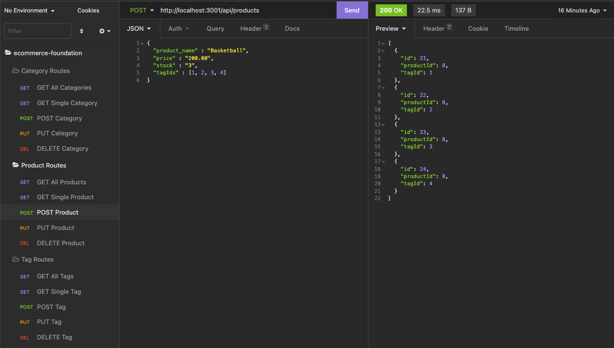

# E-Commerce Foundation

## Description

This application leverages node.js and the express npm package to create API routes for the back end of an E-Commerce website. 

The SQL schema for this application includes Products, Categories and Tags to relate multiple types of information together. 

The routes that I created in this application leverage asynchronous functions to update the data in the database through the server when API calls are received.

## Badges

 

## Table of Contents

- [Installation](#installation)
- [Usage](#usage)
- [License](#license)
- [Contributing](#contributing)
- [Tests](#tests)
- [Questions](#questions)

## Installation

1. Clone the git repository to your local machine. 
2. Login to your local MySQL instance and type ``SOURCE db/schema.sql``.
3. Type the ``USE ecommerce_db`` command to change to the appropriate database.
4. Once complete, run the ``npm i`` command in your bash/terminal to install all of the package dependencies required for the application.
5. Update the environment variables in the ".env.example" file to match your MySQL credentials (remove the ".example" suffix from the file name).
6. Seed your database with test data by running ``npm run seed``. 
7. Run the ``npm start`` command in your integrated terminal to launch the application and start the server.

## Usage

To use the routes built in this application, you will need to leverage a tool such as Postman or Insomnia to generate API calls to the appropriate endpoints. 

The endpoints for this application include:

- http://localhost:3001/api/categories (Supports GET and POST methods)
- http://localhost:3001/api/categories/:id (Supports GET, PUT, DELETE methods)
- http://localhost:3001/api/products (Supports GET and POST methods)
- http://localhost:3001/api/products/:id (Supports GET, PUT, DELETE methods)
- http://localhost:3001/api/tags (Supports GET and POST methods)
- http://localhost:3001/api/tags/:id (Supports GET, PUT, DELETE methods)

The following [video link]() shows the application in action.

## License

This project is licensed under the terms of the [MIT license](https://choosealicense.com/licenses/mit/).

## Contributing

I'm always looking to improve my skills. If, while reviewing the source code, you find any areas that could be optimized, I would love to hear from you.

## Tests

This application does not require any tests.

## Questions

This application was created by [Chris Leavengood](https://github.com/Cleave13). Any questions related to this application can be sent to chrisleavengood@gmail.com